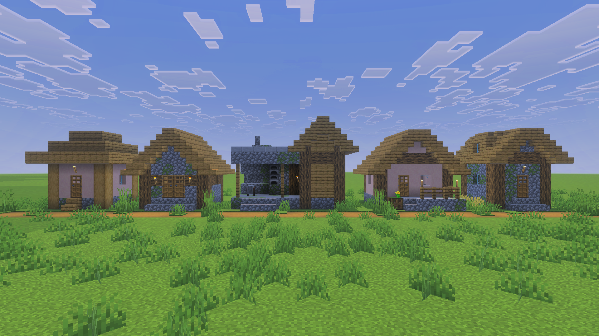
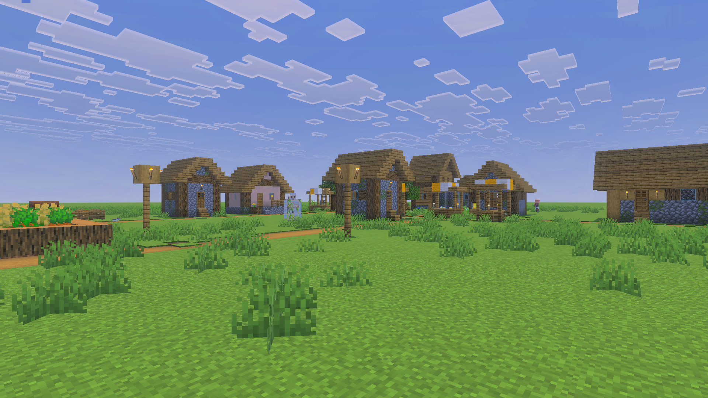
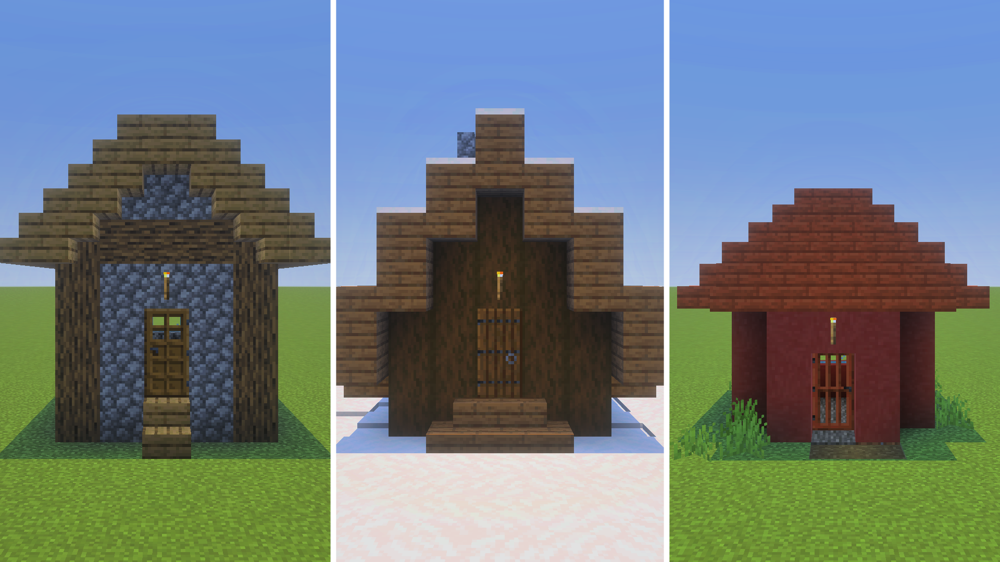
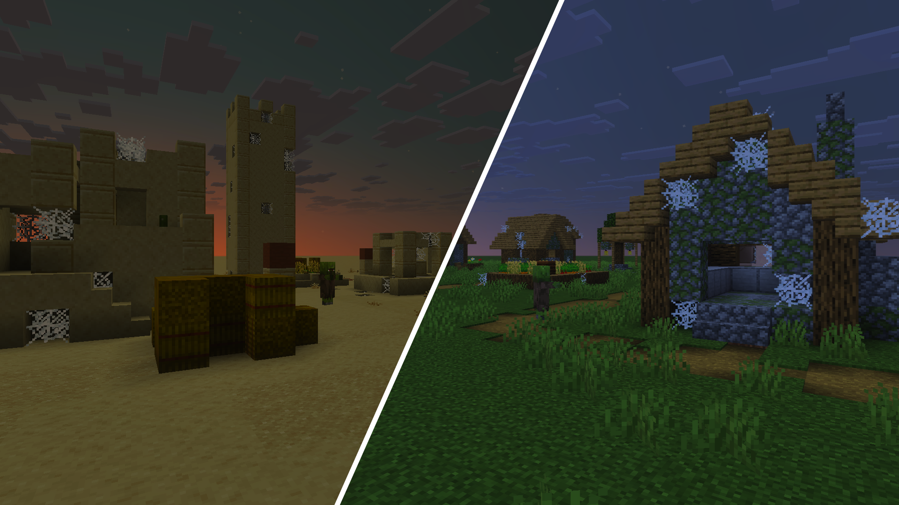
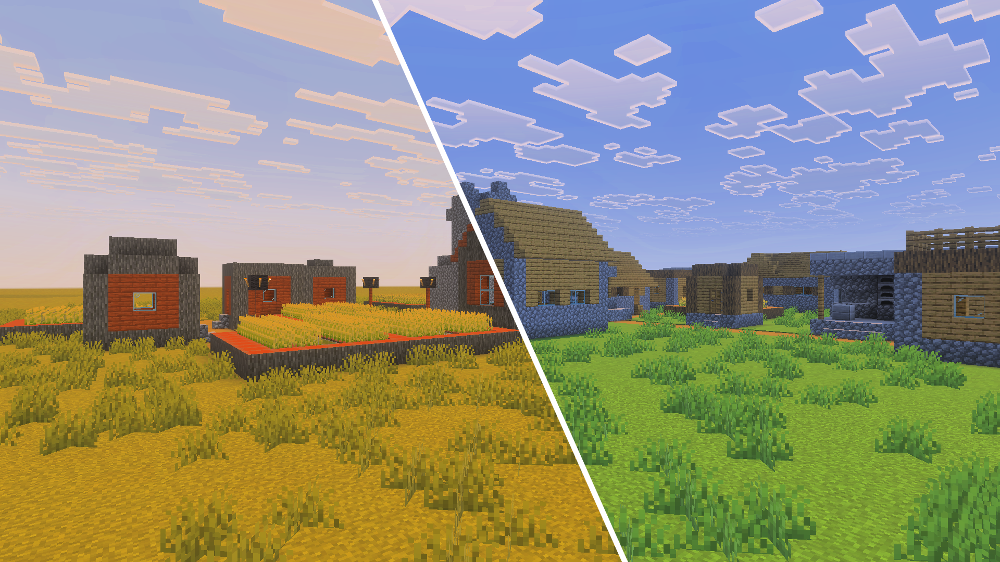
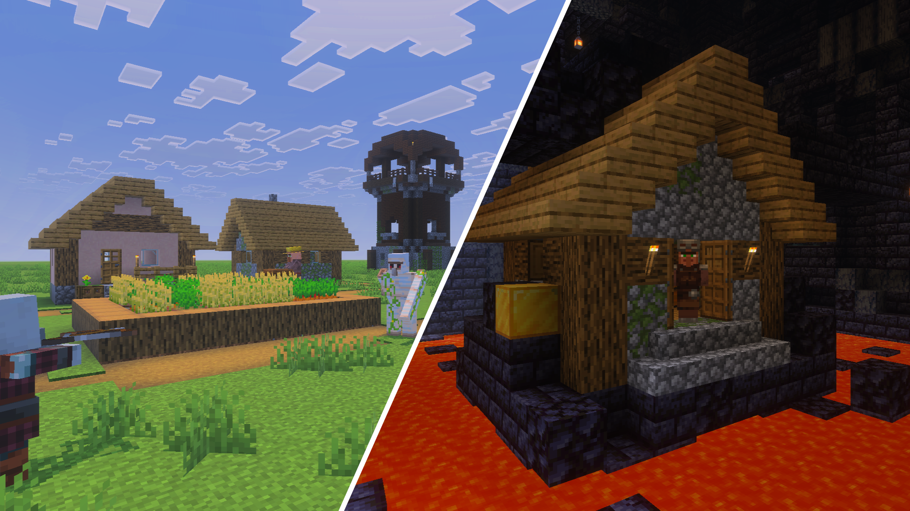

# Village Generator

> Created by [Th3Emilis](https://github.com/th3emilis)

  

Bring your superflat worlds to life in the blink of an eye. Village Generator adds over 600 functions to the game, giving you the power to instantly place villages or easily design your own from scratch.

## Features

### Individual structures
Build your own village, one structure at a time.

### Instant village
Generate an entire village with a single command.

### Multiple village types
Choose from different variants to complement your biome or theme.

### Abandoned villages
Generate instant zombie villages or individual zombie village structures.

### Old village
Generate instant old-type villages or individual old-type village structures.

### Compatible with other generators
Seamlessly pair this add-on with other generators, like [Pillage Generator](https://github.com/th3emilis/pillage-generator/releases/latest) or [Nether Generator](https://github.com/th3emilis/nether-generator/releases/latest).

## Usage

In the chat screen, type `/function vg/help` to get a list of all the available functions in the main directory. Every subdirectory includes a similar function, such as `/function vg/plains/help`. Alternatively, you can use the [web version of the help system](HELP.md).

Once you have found the structure you want to generate, make sure you are standing where you want it to be placed. When selecting a location, keep in mind that structures generate diagonally to the right, in the cardinal direction your character is facing. For example, if you are facing east, the structure will generate toward positive `X` and `Y` coordinate values.

Here are a few functions to get you started:
- `/function vg/instant/old/desert_2`: *Generate a prebuilt Old Desert Village*
- `/function vg/instant/taiga_1`: *Generate a prebuilt Taiga Village*
- `/function vg/instant/zombie_plains_4`: *Generate a prebuilt Abandoned Plains Village*
- `/function vg/snowy/houses/small_house_1`: *Generate a Snowy Small House*
- `/function vg/populate`: *Summon villagers, cats, and an iron golem for your village*

### Recommended settings
In order for instant villages to generate correctly, **it is recommended to set your world’s simulation distance to at least 6 chunks**. Instant villages are large structures and attempting to generate them in unloaded chunks may cause unexpected behavior.

### Using on mobile
Village Generator follows the same (complex) structure naming scheme used internally by Minecraft. If you play on a mobile device, save yourself the pain and start autofilling functions effortlessly with [Advanchat](https://github.com/th3emilis/advanchat/releases/latest).

## Video showcase

## License

To learn what you are permitted and not permitted to do with the add-on, see [Village Generator License](LICENSE.md).

## Feedback

For any suggestions, bugs or help, feel free to [join the Discord community](https://discord.gg/skqthyTkBQ).
