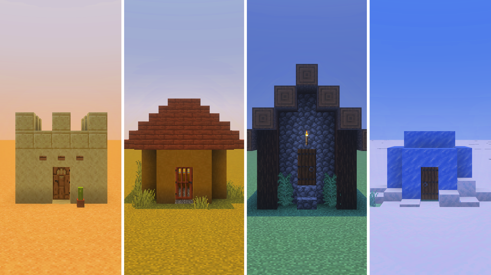

# Village Generator

> Created by [Th3Emilis](https://github.com/th3emilis)

  

Build villages anywhere in your world in the blink of an eye. Village Generator adds over 500 functions to the game to help you instantly place villages, or, if you are feeling creative, to design your own from scratch with ease. Now go bring your superflat worlds to life!

## Features

### Individual structures
Build your own village, one structure at a time.

### Instant village
Generate an entire village with a single command.

### Multiple village types
Choose between different variants to match your biome or theme.

### Abandoned villages
Generate instant zombie villages or individual zombie village structures.

### Old village
Generate instant old-type villages or individual old-type village structures.

### Compatible with other generators
Seamlessly pair this add-on with other generators, like [Pillage Generator](https://github.com/th3emilis/pillage-generator/releases/latest).

## Usage

In the chat screen, type `/function vg/help` to get a list of all the available functions in the main directory. Every subdirectory includes a similar function, such as `/function vg/plains/help`.

Once you have found the structure you want to generate, make sure you are standing where you want it to be placed. When selecting a location, keep in mind that structures generate diagonally to the right, in the cardinal direction your character is facing. For example, if you are facing east, the structure will generate toward positive `X` and `Y` coordinate values.

Here are a few functions to get you started:
- `/function vg/instant/old/desert_2`: *Generate a prebuilt Old Desert Village*
- `/function vg/instant/taiga_1`: *Generate a prebuilt Taiga Village*
- `/function vg/instant/zombie_plains_1`: *Generate a prebuilt Abandoned Plains Village*
- `/function vg/snowy/houses/small_house_1`: *Generate a Snowy Small House*
- `/function vg/populate`: *Summon villagers, cats, and an iron golem for your village*

### Recommended settings
In order for instant villages to generate correctly, **it is recommended that you set your world’s simulation distance to at least 6 chunks**. Instant villages are large structures and attempting to generate them in unloaded chunks may cause some individual structures of the village to fail to generate.

### Using on mobile
Most functions follow the same structure naming scheme used internally by Minecraft. However, having to type complex function commands repeatedly on a mobile device becomes tedious very quickly. For a better experience, you can pair the add-on with [Advanchat](https://github.com/th3emilis/advanchat/releases/latest) to start autofilling and accessing previous functions effortlessly.

## License

To learn what you are permitted and not permitted to do with the add-on, see [Village Generator License](LICENSE.md).

## Feedback

For any suggestions, bugs or help, feel free to [join the Discord community](https://discord.gg/skqthyTkBQ).
