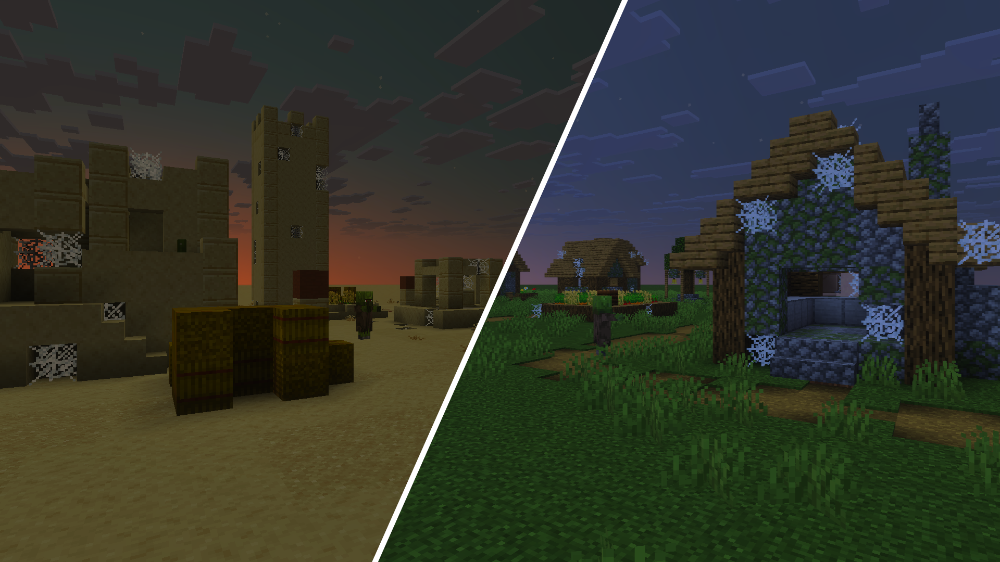

# Village Generator

> Created by [Th3Emilis](https://github.com/th3emilis)

Build villages anywhere in your world with the run of a single command. Village Generator adds various functions to the game to help you design your own village from scratch quickly and easily. Now, go bring more life into your superflat worlds!

## Features

### Individual structures
Build your own village, structure by structure.

### Instant village
Generate an entire village with a single command.

### Multiple village types
Choose between different village types to match your biome or theme.

### Old village
Generate old-type villages or individual old village structures.

## Usage

In the chat screen, type `/function vg/help` to get a list of several available functions. Every subfolder includes a similar help function, such as `/function vg/taiga/help`.

Once you have found the structure you want to generate, make sure you are positioned at the location where you want it to be placed. When selecting a location, keep in mind that structures generate diagonally to the right in the cardinal direction your character is facing. For example, if you are facing east, the structure will generate toward positive `X` and `Y` coordinate values.

Here are a few functions you can try before digging into all the available options:
- `/function vg/instant_village/old/taiga`: *Generate a prebuilt old-type taiga village*
- `/function vg/instant_village/desert_1`: *Generate a prebuilt desert village*
- `/function vg/instant_village/plains_2`: *Generate a prebuilt plains village*
- `/function vg/savanna/houses/small_house_1`: *Generate a savanna small house*
- `/function vg/populate`: *Summon villagers, cats, and an iron golem for your village*

### Recommended settings
In order to ensure that instant villages generate correctly, **it is recommended that you set your simulation distance to at least 6 chunks**. Instant villages are large structures and attempting to generate them in unloaded chunks may cause some individual structures of the village to fail to generate.

### Using on mobile
Many functions use long names that can get tedious to type on a mobile device after a while. For a better experience, you can use the add-on alongside [Advanchat](https://github.com/th3emilis/advanchat/releases/latest), which allows you to autocomplete commands and access previously run commands easily.

## Terms of Use

By downloading, installing, accessing, using or interacting in any way with this add-on, you agree to be bound by the following terms:
- **Attribution** — You must give proper credit to the creator if you reference, use or feature any of the add-on contents (user interface, files, etc.) in your own content, such as videos, blogs, or social media posts.
- **No Redistribution** — You may not reproduce, redistribute or republish the add-on in any form or by any means. You may not share the direct download link or any user-generated link to the add-on. Use one of the [official links](https://github.com/th3emilis/village-generator/blob/main/OFFICIAL_LINKS.md).
- **Non-Commercial** — You may not use the add-on for any commercial or revenue-generating purposes, such as advertising, selling or renting. You may not charge any fees or request any donations for accessing or using the add-on.
- **No Derivates** — You can remix, adapt or build upon the add-on for your own private use, but you may not share, distribute, or make available the modified version of the add-on to any third party. You also agree not to use any part of the add-on (such as files or code snippets) in other add-ons.

## Feedback

For any suggestions, bugs or help, feel free to [join the Discord community](https://discord.gg/skqthyTkBQ).
